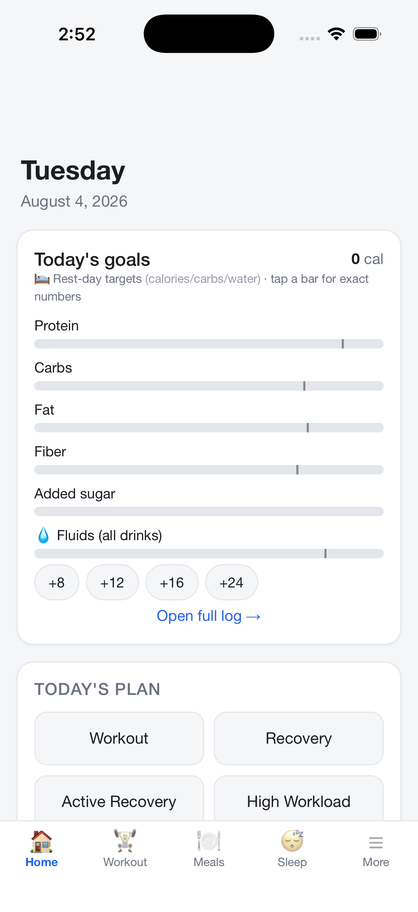
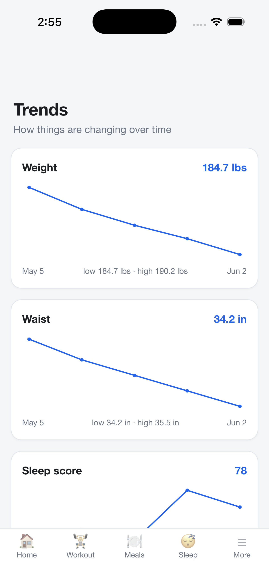
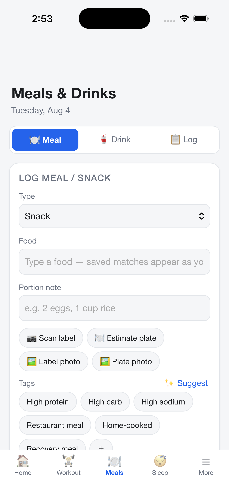
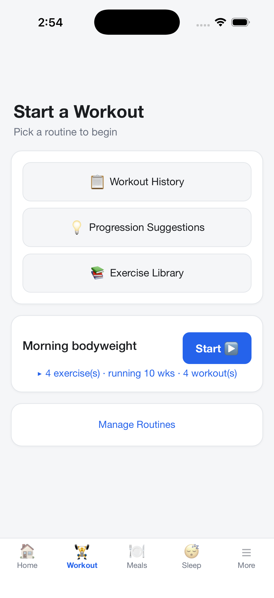
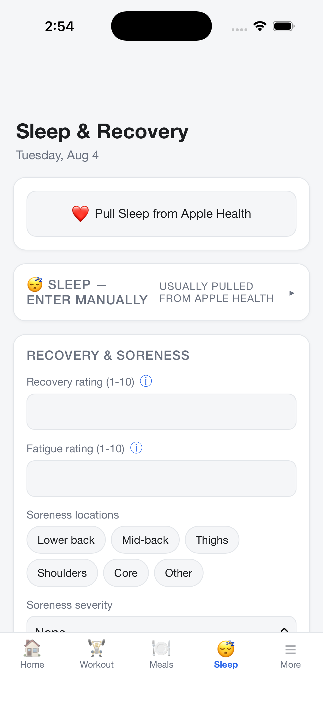
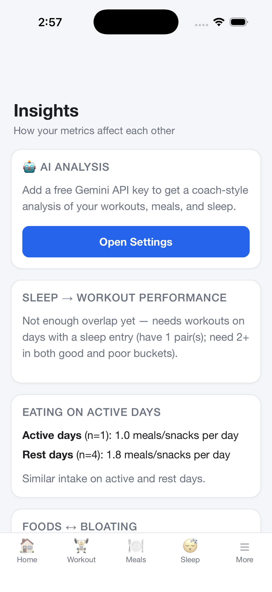
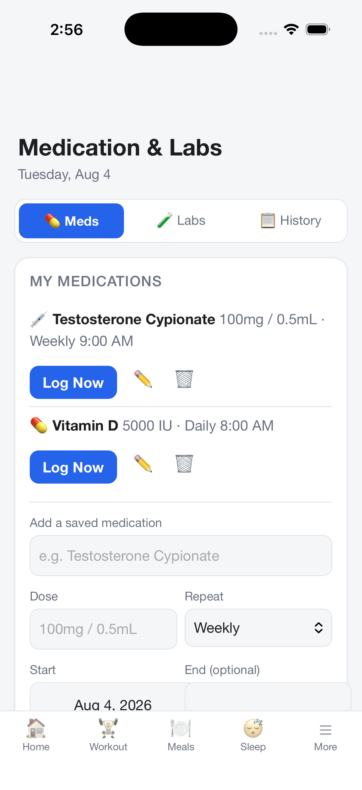
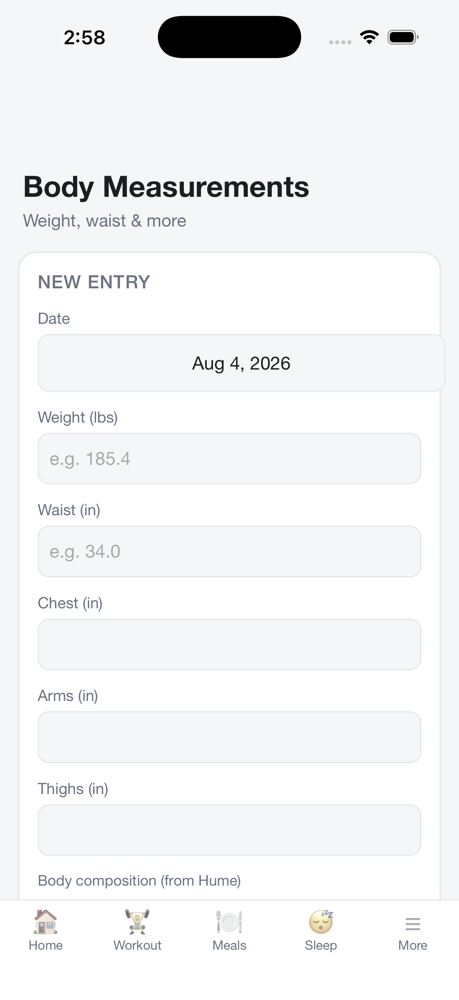
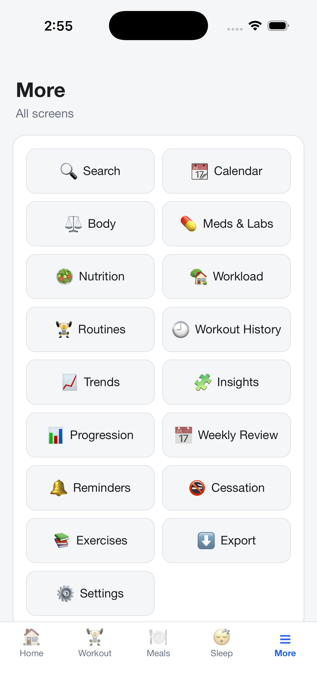

# Fit Recovery Log

[](https://github.com/grumpycoder/health-tracker/actions/workflows/ci.yml)

Offline-first personal health tracker across three clients over one cloud backend — a
.NET MAUI iOS app (local-first, works offline), a Blazor WebAssembly web app, and an Azure
Functions + Azure SQL sync API. Built for personal use — **not** intended for the App Store.

Architected with **Clean Architecture / DDD**: a dependency-free domain, application use
cases, and thin client/server adapters. See [`ARCHITECTURE.md`](./ARCHITECTURE.md) for the
design, and [`healthtracker.md`](./healthtracker.md) for the full feature spec.

## Screenshots

<table>
  <tr>
    <td align="center"><br><sub><b>Home</b> — daily goals & plan</sub></td>
    <td align="center"><br><sub><b>Trends</b> — weight, waist, sleep over time</sub></td>
    <td align="center"><br><sub><b>Meals</b> — logging + AI label/plate scan</sub></td>
  </tr>
  <tr>
    <td align="center"><br><sub><b>Workout</b> — routines & progression</sub></td>
    <td align="center"><br><sub><b>Sleep & Recovery</b></sub></td>
    <td align="center"><br><sub><b>Insights</b> — AI analysis & correlations</sub></td>
  </tr>
  <tr>
    <td align="center"><br><sub><b>Meds & Labs</b> — schedules & logging</sub></td>
    <td align="center"><br><sub><b>Body</b> — measurements & composition</sub></td>
    <td align="center"><br><sub><b>More</b> — every screen</sub></td>
  </tr>
</table>

<sub>Shown with the app's built-in sample data.</sub>

## Stack

- **.NET 9 MAUI Blazor Hybrid** — UI in Razor/HTML/CSS, native iOS shell (C# throughout)
- **EF Core + SQLite** — local-first storage on-device (`fitrecoverylog.db3`)
- Targets: `net9.0-ios` (phone/simulator) and `net9.0-maccatalyst` (fast dev on the Mac)

## Requirements

- macOS + **Xcode 26.5** (the .NET iOS SDK band `26.5` requires it)
- .NET 9 SDK + MAUI workload (`sudo dotnet workload install maui`)

## Run

```bash
cd src/FitRecoveryLog

# Fast iteration on the Mac (no simulator needed):
dotnet build -f net9.0-maccatalyst
open bin/Debug/net9.0-maccatalyst/maccatalyst-arm64/FitRecoveryLog.app

# iOS Simulator (requires an installed iOS simulator runtime):
dotnet build -t:Run -f net9.0-ios
```

Easiest day-to-day: open `FitRecoveryLog.sln` in **Rider** and pick a run target.

## Data

- The EF Core model lives in the **`FitRecoveryLog.Data`** class library (net9.0),
  separate from the MAUI app so `dotnet ef` tooling can load it.
- SQLite DB lives in the app's private data dir
  (`~/Library/Containers/com.mlawrence.fitrecoverylog/Data/Library/fitrecoverylog.db3`
  for MacCatalyst; sandboxed on device).
- Schema is managed by **EF Core migrations**, applied via `Database.Migrate()` on
  startup — first run creates the schema, later runs evolve it **without wiping data**.

### Changing the schema

After editing an entity, generate a migration (the `dotnet-ef` tool is pinned in
`.config/dotnet-tools.json`):

```bash
dotnet tool restore   # first time only
dotnet dotnet-ef migrations add <Name> \
  --project src/FitRecoveryLog.Data \
  --startup-project src/FitRecoveryLog.Data \
  --output-dir Migrations
```

The next app launch applies it automatically.

## Status

Implemented:
- Daily Dashboard (day-type selector, daily note, quick-log buttons)
- Body Measurement logger + history
- Meal & Drink logger (tags, satiety, common-food autocomplete, today's timeline)
- Sleep & Recovery logger (sleep metrics, recovery/fatigue, soreness locations)
- Medication & Labs logger (incl. TRT injection sites; common labs)
- Workout tracking: routines, live-timer sessions, rep/time exercises, feedback
- Workout history (per-session sets + feedback detail)
- Trend charts (weight, waist, sleep, workout duration, drinks by type)
- Progression suggestions (rule-based heuristic — see below)
- Persistent bottom tab navigation
- EF Core migrations (data survives schema changes)
- DEBUG-only sample-data seeder for empty databases

Not yet built: physical workload logger, weekly review, export, HealthKit.

### Progression suggestions

Currently a transparent rule-based heuristic over self-rated difficulty + pain
(`Components/Pages/Progression.razor`, `Evaluate`): pain in the last 2 sessions →
ease off; 2+ consecutive "Easy" → progress; latest Hard/Very hard → hold; else
keep building. **Planned for a later AI phase:** replace `Evaluate` with a
model-driven recommendation fed richer signals (reps/time trend, set completion,
soreness, fatigue, comments). The `Suggestion` shape is kept stable as the seam.

## Notes

- **HealthKit** (Apple Watch/iPhone auto data) is reachable from .NET iOS but not
  yet wired in — v1 is manual entry.
- **iCloud sync** (spec lists as optional) is not implemented; it's an Apple-native
  feature that's awkward from MAUI. Entity keys are GUIDs to keep future sync open.
